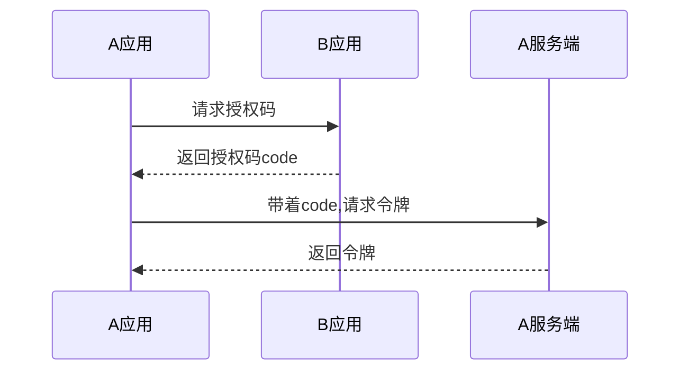
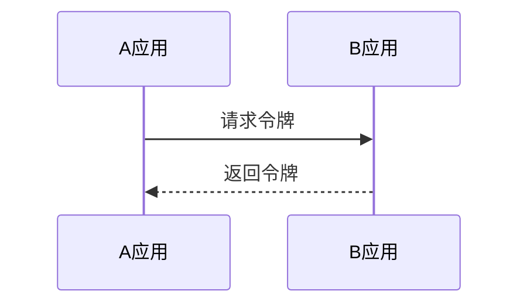

# 关于鉴权

`HTTP` 无状态协议，即每次请求都是独立的，无法获取上一次请求的状态数据。所以每次用户发出`http`请求时，都需要带上能识别鉴定权限的标记。

## `HTTP Basic Authentication`: 请求时携带验证信息，该方法安全性能不高，一般用于登录功能。
## 服务端存储`session`，客户端存`cookie`
1. `cookie`属性：
	- `cookie`跟着会话走的，若浏览器窗口关闭，当前`session`结束，该`cookie`会被删除掉
	- 支持设置过期时间，通过`Max-Age`和`Expires`属性
	- `secure`: `cookie`的`secure`属性指定浏览器只有在加密协议`HTTPS`下，才会把这个`Cookie`发送到服务器
	- `HttpOnly`: `cookie`的`HttpOnly`指定`Cookie`无法通过`JS`脚本获取（`Document.cookie`属性、`XMLHttpRequest`对象和`Request API`都无法获取），只有浏览器发出的`Http`请求才会自动带上
2. `cookie`的读写：
	- 请求返回的头部信息中，`Set-Cookie`表示向浏览器写入一条`cookie`，一次`Http`请求可以返回多个`Set-Cookie`头
	- `cookie`也可以自己创建、并修改，若服务端返回的`Set-Cookie`没有带`HttpOnly`，也支持修改，可通过`document.cookie`来修改
	
## `JWT`（`JSON Web Token`）一个开放标准：通过`header`中传`token`鉴权方式
1. `token`是由服务端在获取用户信息后返回给前端的**能唯一识别该用户的标志**，前端将token存储起来，在每次调用接口时放在头部传到服务端
2. 为增加`token`的安全性，有以下措施：
	- 存储的数据进行`base64`转码
	- 给`token`加签名，通过`token`信息跟**签名** 进行加密算法计算出来得到`.sig cookie`
	- 基于以上，为了规范`token`格式，引入`jwt.io`, [jwt.io](https://jwt.io/introduction)是一种`token`编码方案。
3. `token`优点
	- 减轻服务器压力（服务器不需要保存用户登录信息）
	- 支持跨域访问
	- 性能好：可以直接从`token`中读到`userId`，不需要查询登录状态表
4. `OAuth2.0`: 用于颁发令牌（`token`)，有4种授权方式
  * 授权码 `authorization code`（通过`code`授权码、`redirect_uri`回调网址，例子可看下企业微信提供的授权`API`[例子](https://juejin.cn/post/7069231600302555173)）

  * 隐藏式 `implicit` （同授权码方式类似，通过跳转到中间网站授权之后返回主页面，不同的是，隐藏式是直接放回`token`回来，放在`url`锚点位置）

  * 密码式 `password`（不需要中间页跳转，只需用户给出用户名+密码，服务端在http响应中返回`token`，该方法风险较大）
  * 客户端凭证 `client credentials`（针对第三方应用，不是针对用户，即多个用户可共享同一个令牌）
5. 令牌的更新
	- `refresh_token` 时效性长，当`access_token`失效时，通过`refresh_token`会重新返回新的`access_token`
	- `access_token` 时效性短

