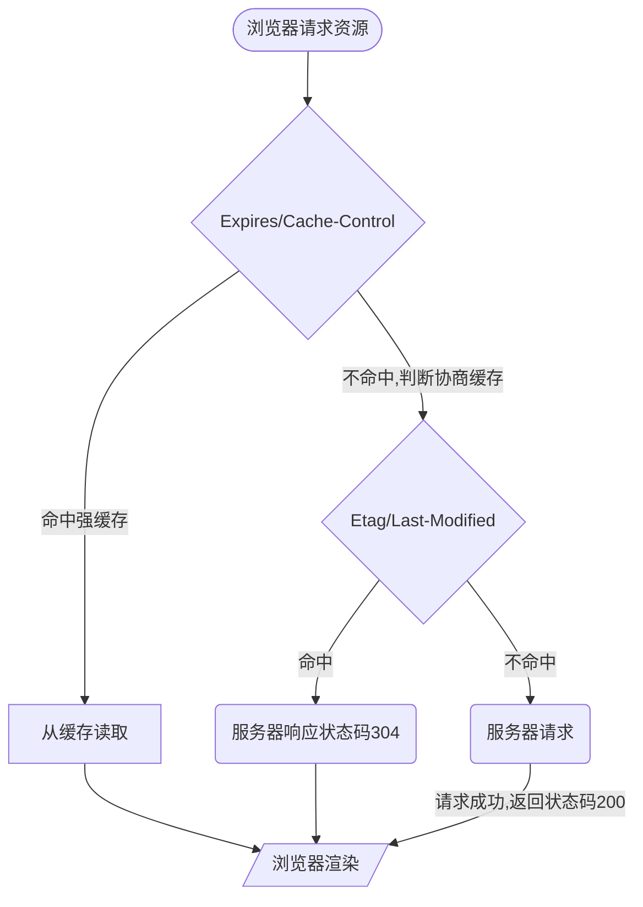

# 缓存优先级

以下是按照优先级排序

## 一、 `service Worker`

1. 开发者编写的额外的脚本，缓存位置独立，目前使用不广泛
2. 它在浏览器上的存储空间在：`f12`打开调试 -> `application` -> `cache Storage`

## 二、 `memory cache`

1. （内存中的缓存）短期存储，不受开发者控制，也不受`http`协议头的约束
2. 存储在内存中，读取速度会比较快
3. 生命周期跟着会话走，一旦浏览器`tab`关闭，该缓存也会被释放
4. 页面首次加载时请求回来的数据会被记录到内存缓存中，按住`f5`刷新时，通过`network` `size`列可观察到，它的`size`显示的： `memory cache`，且耗时`0ms`
   

## 三、 `disk cache` （硬盘中的缓存）也叫`http cache`

**持久存储**，遵守`http`协议头中的字段，`disk cache` 按失效策略可分为以下 2 个

**给个图示：**

### 1、 **强缓存**,命中时,不请求服务器,状态码为**200**

1. `Expires` HTTP 1.0 字段,表示**缓存到期时间**
   - 这里记录的时间是个绝对时间，存在一定的风险，因用户可以更改本机的时间，所以在 HTTP/1.1 版本中新增了`Cache-control`
2. ` Cache-control `` HTTP/1.1 `新增字段,表示**资源缓存的最大有效时间** - `max-age`： 表示缓存的过期时长，单位为秒 - `must-revalidate` - `no-cache`：需要注意这里：设置`no-cache`，**资源还是会被缓存，缓存的资源用于在加载页面时，存在两个或者多个同一资源的请求，这个时候就不会重复请求，只请求一次，后面的拿缓存。** - `no-store`: **真正的表示强制不缓存** - `public`: 所有内容都可被缓存,包括客户端和代理服务器,如`CDN` - `private`: 所有内容只有客户端才可以缓存,代理服务器不能缓存
   如下图，是页面`f5`刷新后看到的请求，可看到命中强缓存的`size`显示`disk cache`，状态码返回 200，且`Cache-Control`里包含了`max-age` 缓存的最长时间，命中此项缓存机制的请求时间也只需**几毫秒**; 通过图中显示协议用的是`h2`,浏览器在`http1.1`之后新增了`Cache-control`来代替`Expires`,因此这里的请求木有`Expires`项
   

### 2、 **对比缓存(协商缓存)**,命中时,不请求服务器,状态码为**304**

强缓存失效后,就启用协商缓存,若命中,则`http`请求返回 304 状态码,对比缓存有**2 组字段**

1. `Last-Modified` & `If-Modified-Since`
   - `Last-Modified`: 资源最后一次更新的时间
   - 服务端通过对比`Last-Modified` 和 `If-Modified-Since`,若两者相等,响应**304**,否则响应**200**
2. `Etag` & `If-None-Match` - `Etag` 由`hash`生成,**存储文件的特殊标志** - 服务端通过对比`Etag` 和 `If-None-Match`,若两者相等,响应**304**,否则响应**200**
   如下图，可看到命中协商缓存的请求状态码是 304，`ETag`返回的是一段**哈希值**，`Last-Modified`是记录最后更新的时间，两者的优先级是 `ETag`**>**`Last-Modified`
   
